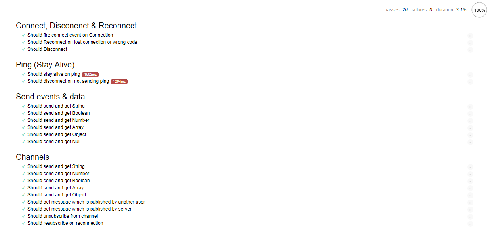

# ClusterWS Tests

Current versions are passing all tests

[ClusterWS](https://github.com/goriunov/ClusterWS):  [](https://badge.fury.io/js/clusterws)

[ClusterWS Client JS](https://github.com/goriunov/ClusterWS-Client-JS):  [](https://badge.fury.io/js/clusterws-client-js)



To run tests clone the repo with:

```
git clone https://github.com/goriunov/ClusterWS-Tests.git
```

then run in cloned folder:

```
npm install
```

and to run it eventually:

```
npm start
```

check `http://localhost:8080`
